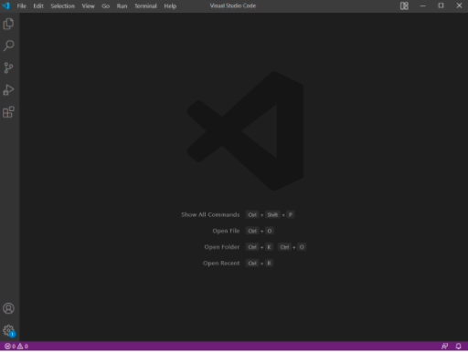
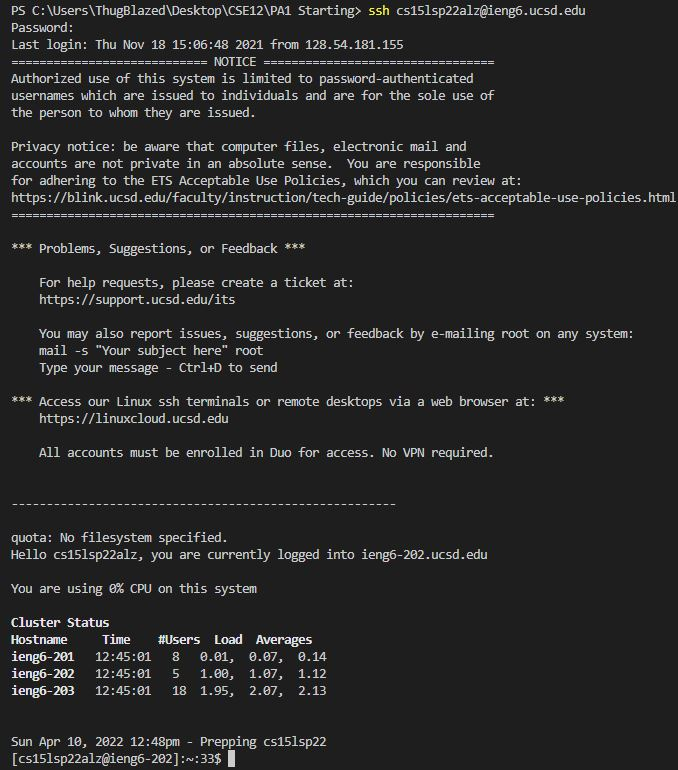
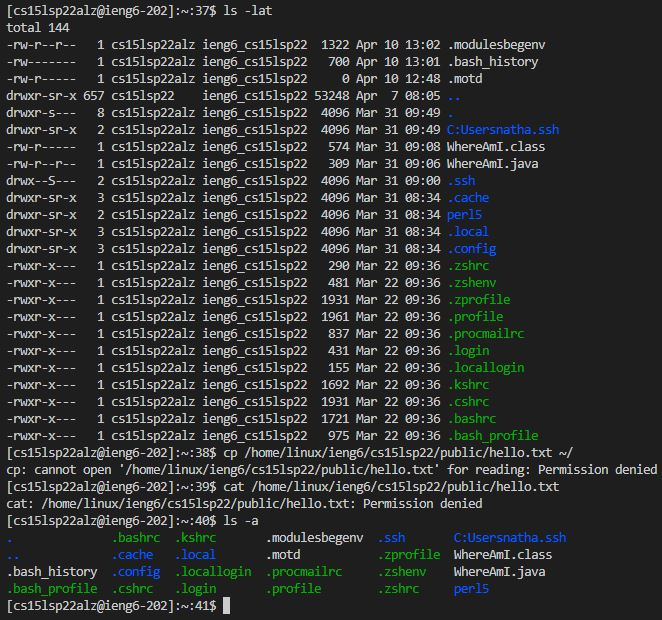
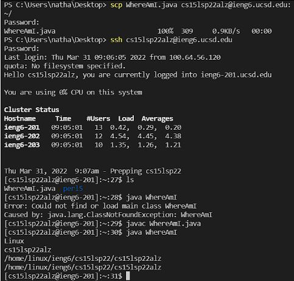
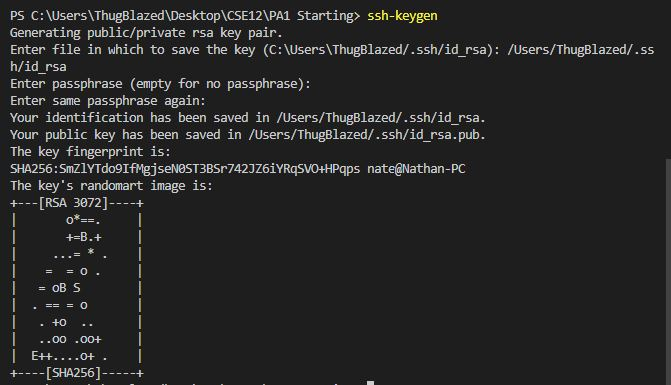
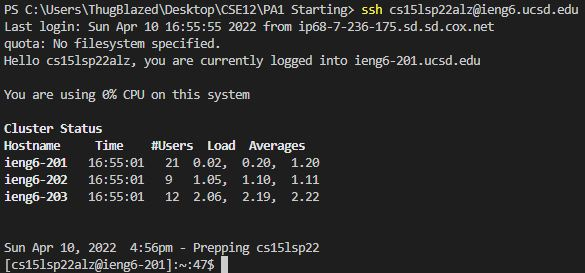

# How to log into course-specific account on *ieng6*
## Step 1: Download VSCode
Click on this [Link](https://code.visualstudio.com/) to go to the Visual Studios code website. Depending on the system you are downloading on (Mac or Windows), follow the instructions on the website to download for your specific system.  
  
  
  
After installing VSCode, and opening up the application, your VSCode window should look like the picture above.
## Step 2: Remotely Connecting
If on a windows system, first you need to install a program called OpenSSH which is a program that will connect your computer to other computers that have this account.  
  
Follow these steps to [Install OpenSSH](https://docs.microsoft.com/en-us/windows-server/administration/openssh/openssh_install_firstuse)  
  
Next you will need to look up your course-specific account for CSE15L here: [https://sdacs.ucsd.edu/~icc/index.php](https://sdacs.ucsd.edu/~icc/index.php)  
  
Your account name should be found under "Additional Accounts".  
  
Now using Visual Studio Code, we will connect to the remote computer using VSCode's remote option.  
  
The first step is to open a terminal in VSCode (Ctrl +, or click on the Terminal tab at the top, then clock on New Terminal). The next step is to type this command in your terminal, but replace the "zz" by the letters in your course-specific account.  
  
`$ ssh cs15lsp22zz@ieng6.ucsd.edu`  
  
If this is your first time connecting to this server, you will probably get a message like this:

`⤇ ssh cs15lsp22zz@ieng6.ucsd.edu`  
  
`The authenticity of host 'ieng6.ucsd.edu (128.54.70.227)' can't be established.`  

`RSA key fingerprint is`  
  
`SHA256:ksruYwhnYH+sySHnHAtLUHngrPEyZTDl/1x99wUQcec.`  
  
`Are you sure you want to continue connecting`  
  
`(yes/no/[fingerprint])?`  
  
Type yes and press enter, it will ask for your password and your password is the password you use to log in to your school account.  
  
After logging in, the whole interaction should look like this:  
  

  
Now your terminal is connected to a computer in the CSE basement, and any commands you run will run on that computer. Your computer is called the _client_ and the computer in the basement is called the _server_.  
  
## Step 3: Trying Some Commands
Try running the commands `cd`, `ls`, `pwd`, `mkdir`, and `cp` a few times in different ways both on _your_ computer, and on the remote computer after doing the ssh command.  
  
Here are some useful commands to try:
- `cd ~`
- `cd`
- `ls -lat`
- `ls -a`
- `ls <directory> where <directory> is /home/linux/ieng6/cs15lsp22/cs15lsp22abc, where the abc is one of the other group members’ username`
- `cp /home/linux/ieng6/cs15lsp22/public/hello.txt ~/`
- `cat /home/linux/ieng6/cs15lsp22/public/hello.txt`  
  
Here is an example of what these commands look like:  
  
  
  
If you want to log out of the remote server in your terminal, you can use:
- Ctrl + D
- Run the command `exit`

## Step 4: Moving Files with `scp`
Now that we have learned to do some work on local and remote computers, one key step in _working remotely_ is being able to copy files back and forth between the computers. In order to do so we will be using the command called `scp`, and we will always run it from the _client_ (YOUR computer). Create a file on your computer called `WhereAmI.java` and put the following code into it:
```
class WhereAmI {
  public static void main(String[] args) {
    System.out.println(System.getProperty("os.name"));
    System.out.println(System.getProperty("user.name"));
    System.out.println(System.getProperty("user.home"));
    System.out.println(System.getProperty("user.dir"));
  }
}
```
Run it using `javac` and `java` on your computer. You should be seeing different contents from your own computer.  
  
Next, in the terminal from the directory where you made this file, run this command (replacing zz with your username):  
  
`scp WhereAmI.java cs15lsp22zz@ieng6.ucsd.edu:~/`  
  
You should be prompted for a password.  
  
Now, log back into ieng6 with ssh again, and type the command `ls`. Now you will see the file that you created in your own computer in the home directory of the _ieng6_ computer. You will be able to now run that file on the _ieng6 computer_ using `javac` and `java`.  
  
Here is an example of what that process should look like:  
  
  
  
## Step 5: Setting an SSH Key
Every time we log in using `ssh` or run `scp` we have to type our password. It gets frustrating and time consuming having to do this all the time, so we will be using `ssh` keys. A program called `ssh-keygen` creates a pair of files called the `public key` and `private key`. You copy the public key to a particular location on the server, and the private key in a particular location on the client. Then, the `ssh` command can use the pair of files in place of your password.  
  
Here is what to run when setting this up:  
  
`# on client (your computer)`  
  
`$ ssh-keygen`  
  
`Generating public/private rsa key pair.`  
  
`Enter file in which to save the key (/Users/<user-name>/.ssh/id_rsa): /Users/<user-name>/.ssh/id_rsa`  
  
`Enter passphrase (empty for no passphrase):`  
  
Make sure you do not add a paraphrase for this step (just press enter).  
  
`Enter same passphrase again:`  
  
`Your identification has been saved in /Users/<user-name>/.ssh/id_rsa.`  
  
`Your public key has been saved in /Users/<user-name>/.ssh/id_rsa.pub.`  
  
`The key fingerprint is:`  
  
`SHA256:jZaZH6fI8E2I1D35hnvGeBePQ4ELOf2Ge+G0XknoXp0 <user-name>@<system>.local`  
  
`The key's randomart image is:`  
  
`+---[RSA 3072]----+`  
  
`|                 |`  
  
`|       . . + .   |`  
  
`|      . . B o .  |`  
  
`|     . . B * +.. |`  
  
`|      o S = *.B. |`  
  
`|       = = O.*.*+|`  
  
`|        + * *.BE+|`  
  
`|           +.+.o |`  
  
`|             ..  |`  
  
`+----[SHA256]-----+`  
  
This is what running these steps in the terminal looks like:  
  
  
  
If on Windows system, follow the extra `ssh-add` steps here:  
  
[https://docs.microsoft.com/en-us/windows-server/administration/openssh/openssh_keymanagement#user-key-generation](https://docs.microsoft.com/en-us/windows-server/administration/openssh/openssh_keymanagement#user-key-generation)  
  
This creates two new files on your system; the private key (in a file `id_rsa`) and the public key (in a file `id_rsa.pub`), stored in the `.ssh` directory on your computer.  
  
The next step is to copy the _public_ key to the `.ssh` directory of your user account on the server.  
  
`$ ssh cs15lsp22zz@ieng6.ucsd.edu`  
  
`<Enter Password>`  
  
`# now on server`  
  
`$ mkdir .ssh`  
  
`$ <logout>`  
  
`# back on client`  
  
`$ scp /Users/<user-name>/.ssh/id_rsa.pub cs15lsp22zz@ieng6.ucsd.edu:~/.ssh/authorized_keys`  
  
`# You use your username and the path you saw in the command above`  
  
After finishing these steps, when logging in using `ssh` or running `scp`, you won't need to enter your password again.  
  
This is what your terminal would look like, as it automatically logs you in without a password:  
  
  
  
## Step 6: Optimizing Remote Running

After making an edit to a file in the client, and you want to copy that edited file to the server in a more efficient way here are the steps:
1. After making an edit, type in `scp <FileName> cs15lsp22zz@ieng6.ucsd.edu:~/` in the terminal.
2. Next, type in `ssh cs15lsp22zz@ieng6.ucsd.edu "javac <FileName>"` to compile the file in the server.
3. Lastly, type in `ssh cs15lsp22zz@ieng6.ucsd.edu "java <FileName>"` to run it in the server.


  


