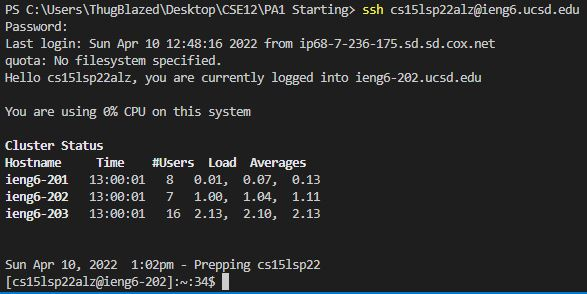

# How to log into course-specific account on *ieng6*
## Step 1: Download VSCode
Click on this [Link](https://code.visualstudio.com/) to go to the Visual Studios code website. Depending on the system you are downloading on (Mac or Windows), follow the instructions on the website to download for your specific system.  
  
  
  
After installing VSCode, and opening up the application, your VSCode window should look like the picture above.
## Step 2: Remotely Connecting
If on a windows system, first you need to install a program called OpenSSH which is a program that will connect your computer to other computers that have this account.  
  
Follow these steps to [Install OpenSSH](https://docs.microsoft.com/en-us/windows-server/administration/openssh/openssh_install_firstuse)  
  
Next you will need to look up your course-specific account for CSE15L here: [https://sdacs.ucsd.edu/~icc/index.php](https://sdacs.ucsd.edu/~icc/index.php)  
  
Your account name should be found under "Additional Accounts".  
  
Now using Visual Studio Code, we will connect to the remote computer using VSCode's remote option.  
  
The first step is to open a terminal in VSCode (Ctrl +, or click on the Terminal tab at the top, then clock on New Terminal). The next step is to type this command in your terminal, but replace the "zz" by the letters in your course-specific account.  
  
`$ ssh cs15lsp22zz@ieng6.ucsd.edu`  
  
If this is your first time connecting to this server, you will probably get a message like this:

`⤇ ssh cs15lsp22zz@ieng6.ucsd.edu`  
  
`The authenticity of host 'ieng6.ucsd.edu (128.54.70.227)' can't be established.`  

`RSA key fingerprint is`  
  
`SHA256:ksruYwhnYH+sySHnHAtLUHngrPEyZTDl/1x99wUQcec.`  
  
`Are you sure you want to continue connecting`  
  
`(yes/no/[fingerprint])?`  
  
Type yes and press enter, it will ask for your password and your password is the password you use to log in to your school account.  
  
After logging in, the whole interaction should look like this:  
  

  
Now your terminal is connected to a computer in the CSE basement, and any commands you run will run on that computer. Your computer is called the _client_ and the computer in the basement is called the _server_.  
  
## Step 3: Trying Some Commands
Try running the commands `cd`, `ls`, `pwd`, `mkdir`, and `cp` a few times in different ways both on _your_ computer, and on the remote computer after doing the ssh command.  
  
Here are some useful commands to try:
- `cd ~`
- `cd`
- `ls -lat`
- `ls -a`
- `ls <directory> where <directory> is /home/linux/ieng6/cs15lsp22/cs15lsp22abc, where the abc is one of the other group members’ username`
- `cp /home/linux/ieng6/cs15lsp22/public/hello.txt ~/`
- `cat /home/linux/ieng6/cs15lsp22/public/hello.txt`  
  
Here is an example of what these commands look like:

  

