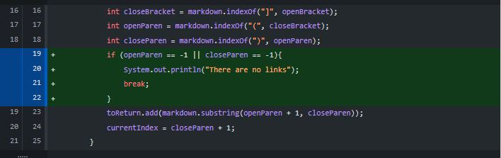
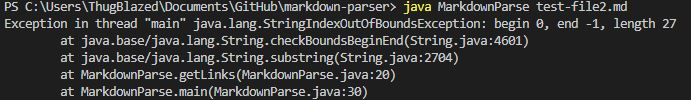
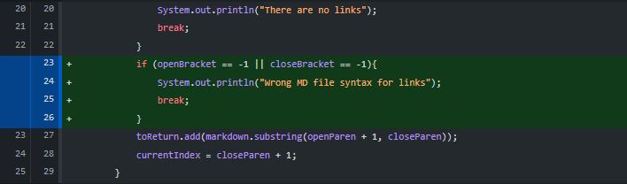
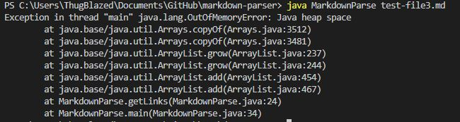
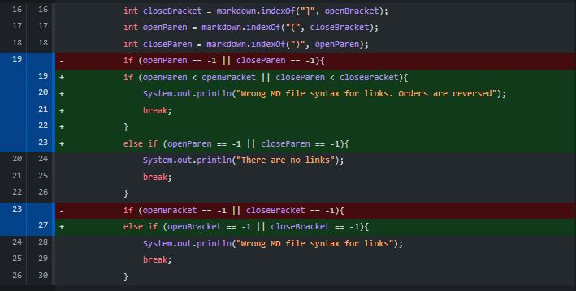
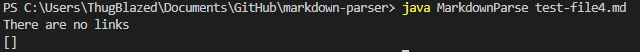

# Code Change 1

Code Change Diff:
  
  
[Link to the test file for failure inducing input](https://github.com/nbilog/markdown-parser/blob/main/test-file2.md)  
  
Symptom of failure inducing input:

The bug was that there was no parenthesis to be found in the md file, resulting in the values of openParen and closeParen to be 0. The symptom showed a string index out of bounds exception in which for the substring method, a negative value can not be used as the argument which also results in the bug. The failure inducing input had no parenthesis at all resulting in this getLinks method to throw an exception.

# Code Change 2

Code Change Diff:
  
  
[Link to the test file for failure inducing input](https://github.com/nbilog/markdown-parser/blob/main/test-file3.md)

Symptom of failure inducing input:

The bug was that the value of openBracket and closeBracket would equal -1 and those values are going to be used in the arguments of the indexOf method in openParen and closeParen. Since the index of -1 doesn't immediately throw an exception, the program will keep running infinitely in which that is what the symptom shows. The failure inducing input has no brackets, therefore the opeBracket and closeBracket values will be -1.

# Code Change 3

Code Change Diff:
  
  
[Link to the test file for failure inducing input](https://github.com/nbilog/markdown-parser/blob/main/test-file4.md)  
  
Symptom of failure inducing input:

The symptom showed that there is no link in the file, however there was but the order of the syntax are just reversed. The bug was that there was no edge case to accomodate for the output of a wrong syntax. Since there are parenthesis and brackets, the program will run perfectly fine but produces the wrong output. The failure inducing input has these parenthesis and brackets, however they are in the wrong order of the syntax of a link, resulting in the output.