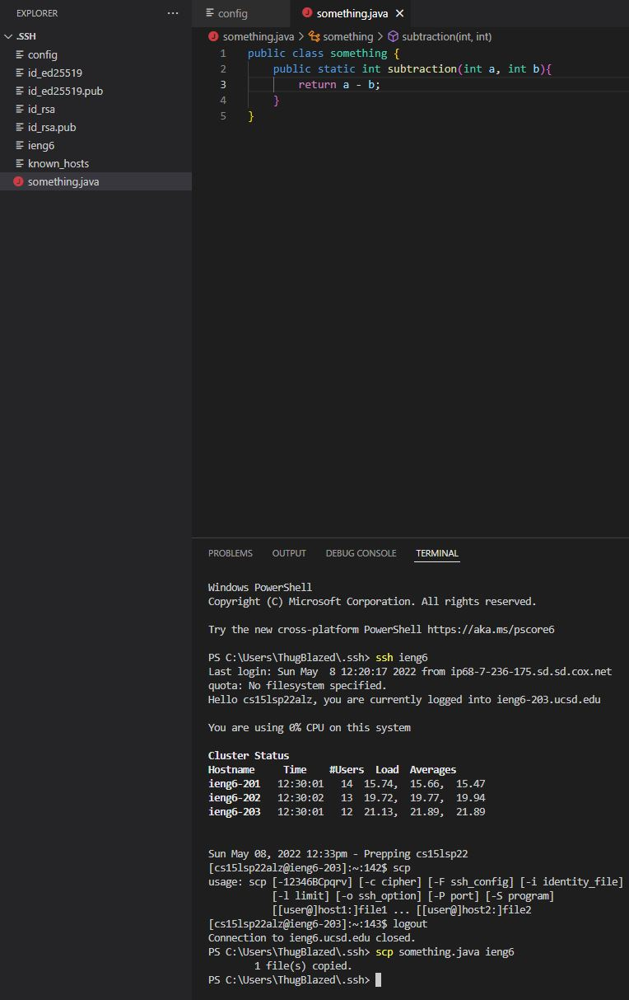
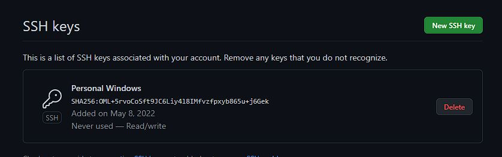
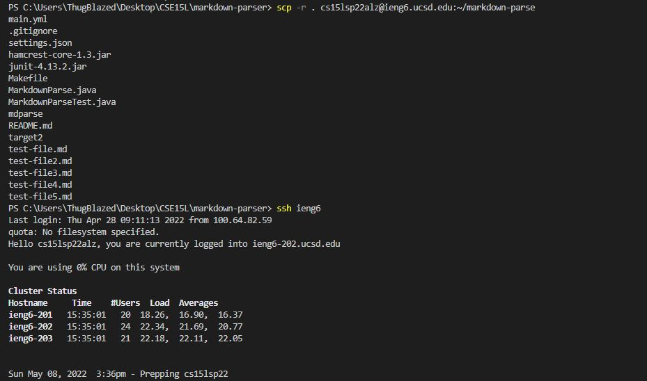
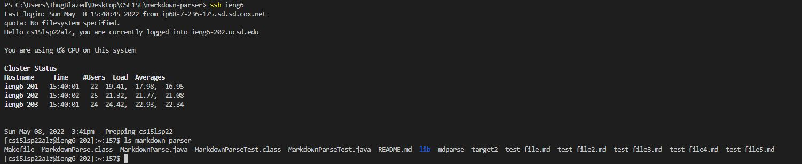

## Streamlining ssh Configuration
- .ssh/config file  

- ssh command  

- scp command  

## Setup Github Access from ieng6
- public key on github and user account  
  

  
## Copy Whole Directories with scp -r
- copy of whole markdown-parse directory to ieng6

