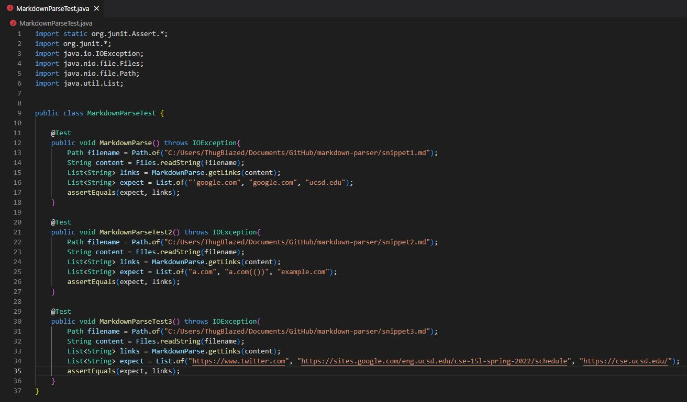
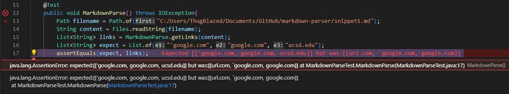

[Link to my repository](https://github.com/nbilog/markdown-parser)

[Link to repository I reviewed](https://github.com/NLChung9/markdown-parser)

Output of snippet 1: ['google.com, google.com, ucsd.edu]

Output of snippet 2: [a.com, a.com(()), example.com]

Output of snippet 3: [https://www.twitter.com, https://sites.google.com/eng.ucsd.edu/cse-15l-spring-2022/schedule, https://cse.ucsd.edu/]

Code in MarkdownParseTest.java: 

For my implementation:
* snippet 1: Test did not pass, 
* snippet 2: Test did not pass, 
* snippet 3: Test did not pass, 

For reviewed code implementation:
* snippet 1: Test did not pass, 
* snippet 2: Test did not pass, 
* snippet 3: Test did not pass, 
