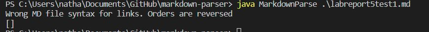
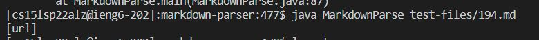
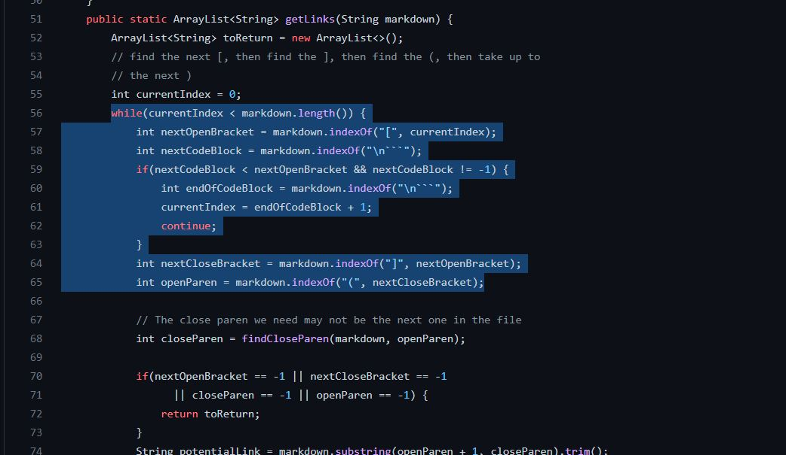
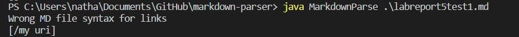
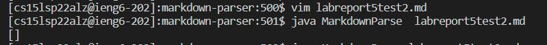
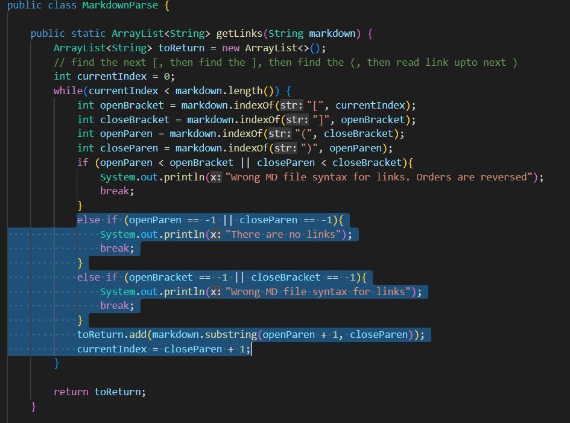

How I found tests with different results is that I manually found these differences. I ran random test files in the markdownparse repository from lab 9. 
Once I found a test file that didn't give an empty output, I copied that file to my own markdownparse implementation to see if there is a difference in outputs. Some tests weren't able to be cloned into my ieng6, so instead, I used vim editor to create a new file to put in the test that wasn't cloned.

[Link to test first file with different results](https://github.com/nidhidhamnani/markdown-parser/blob/main/test-files/194.html.test)

## Test 1
My implmentation is correct because it gave an empty list of links since this test file has no links in it.

Output for my implementation:

Output for LAB9 implementation:

Expected output should be [].

The bug in the LAB9 implementation is that the code runs even when there isn't a closed bracket present in the md file. In order to create a link, it would need correct formatting, therefore, the code should continue running, only if it first sees that there is a closed bracket to begin with.

[Link to second test file with different results](https://github.com/nidhidhamnani/markdown-parser/blob/main/test-files/487.html.test)

## Test 2
LAB9 implementation is correct because it gave a an empty list which it should result in since a space in a link makes it not a link.

Output for my implementation:

Output for LAB9 implementation:

Expected output should be [].

The bug in my implementation is that my code only detects the errors in the formatting of the link, and not the data inside of these brackets and parenthesis. My code would need to make it so that if there is a space in the link part (in the parenthesis), then don't add that link since a space makes it not a link.

